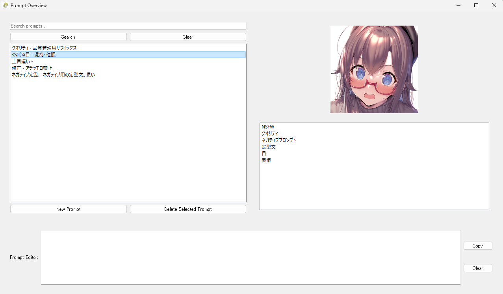

# pman




pmanは、主にStableDiffusionなどで使用されるプロンプトを管理するためのデスクトップアプリケーションです。プロンプトの作成、編集、検索、タグ付け、および画像の添付ができます。
webuiのwildcardsとは別の管理方法が欲しくなったため作成しました。

## 特徴

- プロンプトの作成、編集、削除
- プロンプトの検索とフィルタリング
- タグを使用したプロンプトの分類
- プロンプトへの画像の添付（ドラッグ＆ドロップまたはファイル選択）

## 使用方法

### インストール

1. リポジトリをクローンします。
```bash
git clone https://github.com/0rangaxx/pman.git
```

2. プロジェクトディレクトリに移動します。
```bash
cd pman
```

3. install.batをダブルクリックします。

### 起動方法

startup.batをダブルクリックします


### プロンプトの作成

1. "New Prompt"ボタンをクリックします。
2. プロンプトのタイトル、内容、説明を入力します。
3. 必要に応じてタグを追加します。
4. 画像をドラッグ＆ドロップするか、"Select Image"ボタンをクリックして画像を選択します。
5. "Save"ボタンをクリックしてプロンプトを保存します。

### プロンプトの編集

1. プロンプトリストから編集するプロンプトをダブルクリックします。
2. 新規作成と同様にプロンプトの詳細を編集します。
3. "Save"ボタンをクリックして変更を保存します。

### プロンプトの削除

1. プロンプトリストから削除するプロンプトを選択します。
2. "Delete Selected Prompt"ボタンをクリックします。
3. 確認ダイアログで"Yes"をクリックしてプロンプトを削除します。

### プロンプトの検索とフィルタリング

- 検索バーにキーワードを入力し、"Search"ボタンをクリックしてプロンプトを検索します。
- タグリストからタグをクリックすると、そのタグが付けられたプロンプトがフィルタリングされます。

## 依存関係

- Python 3.7以上
- PyQt5 5.15.9
- requests 2.28.2

## ライセンス

このプロジェクトは[GNU Affero General Public License v3.0](LICENSE)の下で公開されています。